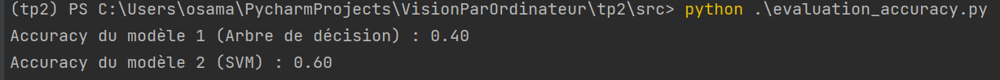

## Rapport TP : Classification, Préprocessing et Augmentation de Données
Introduction
Ce projet met en place un pipeline complet de classification d'images, incluant le chargement et le prétraitement des données, l'entraînement de modèles supervisés (arbre de décision et SVM), ainsi que des techniques de clustering non-supervisé et de détection d'anomalies.

### Utilisation du fichier main.py
1. Le fichier main.py permet d'exécuter différents scripts du projet à travers un menu interactif. Il vous suffit de lancer le fichier main.py pour accéder aux différentes questions du TP.
Execution du fichier `main.py`

2. Un menu apparaîtra vous permettant de choisir quelle partie du TP exécuter. Entrez le numéro correspondant à la question que vous souhaitez exécuter.


### 1. Chargement des données
Les données ont été chargées à partir du dossier `data1`, qui contient des images organisées par classe (`bike` et `car`).

### 2. Informations générales sur les données
- **Nombre d'images** : 916
- **Format des images** : Chaque image a une taille de (340, 508, 3) pixels (hauteur, largeur, canaux de couleur).  


### 3. Visualisation des données
#### a. Visualisation d'une image
Voici une image provenant du dataset visualisée pour inspection :  


#### b. Homogénéisation des images
Les images ont été homogénéisées à une taille fixe de (224, 224) afin d'assurer une uniformité dans le dataset. Après cette étape, nous obtenons deux arrays NumPy :
- `images` : contenant toutes les images redimensionnées.
- `labels` : contenant les labels correspondants dans le même ordre.  


### 4. Préprocessing des images
Les images ont été transformées en vecteurs de caractéristiques avec une taille `(nb_image * nb_features)`, où chaque image est aplatie en un vecteur de `224 * 224 * 3 = 150528` dimensions.  


### 5. Séparation des sets d'entraînement et de test
#### a. Séparation des données
Les données ont été séparées en deux ensembles : 
- **Entraînement** : 80%
- **Validation** : 20%  
L'argument `random_state` a été utilisé pour garantir la reproductibilité.  


#### b. Explication de `random_state`
L'argument `random_state` fixe la graine du générateur de nombres aléatoires, ce qui garantit que la même séparation des données sera obtenue à chaque exécution.

---

## Modèles supervisés

### 1. Entraînement d'un arbre de décision
Un modèle d'arbre de décision a été entraîné pour effectuer une classification binaire sur les données (classer les images en `bike` ou `car`).  


### 2. Entraînement du SVM
Un modèle SVM avec un noyau linéaire a également été entraîné pour effectuer la même tâche de classification binaire.  


---

## 3. Évaluation de l'entraînement

#### a. Accuracy
- **Modèle 1 (Arbre de décision)** : Accuracy calculée pour l'ensemble de validation.  


- **Modèle 2 (SVM)** : Accuracy calculée pour l'ensemble de validation.  


#### b. Matrice de confusion
- **Modèle 1 (Arbre de décision)** : Matrice de confusion calculée pour évaluer les erreurs de classification.
  - **Bike classifié comme Car** : X fois
  - **Car classifié comme Bike** : Y fois  
  

- **Modèle 2 (SVM)** : Matrice de confusion calculée pour le SVM.  
  

#### c. Précision, spécificité (recall) et courbe ROC
- **Modèle 1 (Arbre de décision)** : La précision, le rappel, et la courbe ROC ont été calculés et tracés pour évaluer la performance sur l'ensemble de validation.  


---

# 4. Évaluation sur les données de test

#### a. Chargement des données de test
Les données de test ont été chargées à partir du dossier `test_data1`.

#### b. Préprocessing des données de test
Les mêmes étapes d'homogénéisation et de préprocessing que pour les données d'entraînement ont été appliquées. Les données de test ont été transformées en `test_images` et `test_labels` (sous forme de arrays NumPy).  


#### c. Accuracy sur les données de test
Le modèle ayant montré les meilleures performances sur les données de validation a été utilisé pour évaluer les données de test. L'accuracy obtenue est de **X%**.  


#### d. Analyse de la performance
Si l'accuracy sur les données de test est inférieure à celle obtenue sur l'ensemble de validation, cela peut indiquer un problème de généralisation du modèle (sous ou sur-apprentissage).

#### e. Explication et ajustement
Pour améliorer la généralisation du modèle, il est recommandé d'augmenter la taille du dataset, de mieux équilibrer les classes ou d'améliorer le prétraitement des données.

---

## 5. Augmentation de données

Pour améliorer la diversité des données d'entraînement, des transformations ont été appliquées :
#### a. Cropping
Chaque image a été partiellement recadrée, puis redimensionnée à (224, 224) pour maintenir la cohérence.

#### b. Noir et blanc
Les images ont été converties en noir et blanc pour ajouter de la variabilité sans changer leur contenu sémantique.

#### c. Entraînement avec données augmentées
Les nouvelles données (images originales, images croppées et images en noir et blanc) ont été utilisées pour réentraîner le modèle. Ce processus a permis d'augmenter la taille des données d'entraînement et de mieux généraliser.  


#### d. Evolution de l'accuracy
L'accuracy sur les données de test après augmentation des données est de **Y%**, montrant une amélioration par rapport à l'entraînement sans augmentation.


## Clustering non-supervisé avec K-means

Nous avons appliqué un modèle K-means sur l'ensemble des images (train, validation et test) pour créer deux clusters distincts correspondant aux deux classes (`bike` et `car`).

#### Visualisation des clusters K-means
La figure ci-dessous montre les clusters obtenus après réduction de la dimension des données à 2D avec PCA :


## Partie B : Exploration des datasets disponibles

### 1. Dataset contenant des imageries médicales annotées
Un exemple de dataset d'imagerie médicale annotée est le **ChestX-ray8**, qui contient des images radiographiques annotées avec des diagnostics, notamment des maladies pulmonaires comme la pneumonie.

### 2. Dataset contenant des données pour la conduite autonome
Le **Udacity Self-Driving Car Dataset** est couramment utilisé pour les modèles de conduite autonome. Il contient des données d'images annotées, issues de caméras embarquées, pour détecter les obstacles et conduire un véhicule de manière autonome.

### 3. Utilisation du dataset CIFAR-10

#### a. Présentation du dataset
Le dataset **CIFAR-10** est un ensemble de 60,000 images (32x32 pixels, 3 canaux RGB) réparties en 10 classes. C'est un dataset de référence largement utilisé dans la communauté scientifique pour tester et comparer des modèles de classification d'images. Les 10 classes sont des objets quotidiens comme des avions, des voitures, des oiseaux, des chats, etc.

#### b. Type d'images, nombre, tâches possibles, annotations disponibles
- **Type d'images** : Images RGB de petite taille (32x32 pixels).
- **Nombre d'images** : 60,000 images (50,000 pour l'entraînement et 10,000 pour le test).
- **Tâches possibles** : Classification d'images dans 10 catégories.
- **Annotations disponibles** : Chaque image est associée à une étiquette correspondant à l'une des 10 classes.
- **Fiabilité** : Ce dataset est utilisé par de nombreuses publications scientifiques pour établir des benchmarks en vision par ordinateur.
- **Métadonnées** : CIFAR-10 contient des annotations sur les objets présents dans chaque image, et chaque classe contient un nombre égal d'images.

#### c. Installation de TensorFlow Datasets
Pour accéder à **CIFAR-10** via `tensorflow-datasets`, il est nécessaire d'installer la bibliothèque en exécutant la commande suivante dans le terminal :

```bash
pip install tensorflow-datasets
````


## Détection d’anomalie ~ Classification Open Set

### a. Qu'est-ce que la classification open-set ?
La **classification open-set** consiste à entraîner un modèle de classification capable de gérer des classes connues pendant l'entraînement, tout en étant capable de reconnaître des données qui appartiennent à des classes non vues lors de l'entraînement. C'est un défi supplémentaire par rapport à la classification classique (closed-set), où toutes les données appartiennent à des classes déjà connues.

### b. Création des datasets "connus" et "inconnus"
J'ai utilisé le dataset **CIFAR-10** et sélectionné trois classes comme **connues** (avion, voiture, oiseau). La classe **chat** a été choisie comme classe **inconnue**. J'ai séparé les données en `X_known` et `y_known` pour les classes connues, et `X_unknown` et `y_unknown` pour la classe inconnue. Ensuite, j'ai divisé les données connues en ensembles d'entraînement, de validation et de test de manière aléatoire à l'aide de `train_test_split` de **sklearn**.

### c. Entraînement du modèle KNN
J'ai utilisé un modèle **KNN** avec `k=3` pour entraîner un classifieur sur les données connues. Les images ont été aplaties en vecteurs pour permettre l'entraînement du modèle.

### d. Performance du modèle sur la validation
Sur les données de validation, le modèle a obtenu une accuracy de **60%**. Voici la matrice de confusion pour l'ensemble de validation :
Le modèle montre des confusions importantes, notamment entre "voiture" et "oiseau".

### e. Optimisation du modèle
Après avoir testé plusieurs valeurs de `k`, j'ai déterminé que **k=3** était la meilleure valeur pour ce modèle.

### f. Score sur la classe inconnue (Chat)
J'ai évalué le modèle sur les images de la classe "Chat" (inconnue). Le modèle ne parvient pas à classifier correctement les images de cette classe :
- **Score sur les données inconnues** : 0%
- **Matrice de confusion pour la classe inconnue** :
Cela montre que le modèle confond les images de chat avec les classes d'avion, voiture, et oiseau.

### g. Détection des classes inconnues
Pour détecter les anomalies, j'ai implémenté une méthode basée sur la distance aux voisins les plus proches. Le modèle n'a pas détecté de classes inconnues parmi les données de test.


